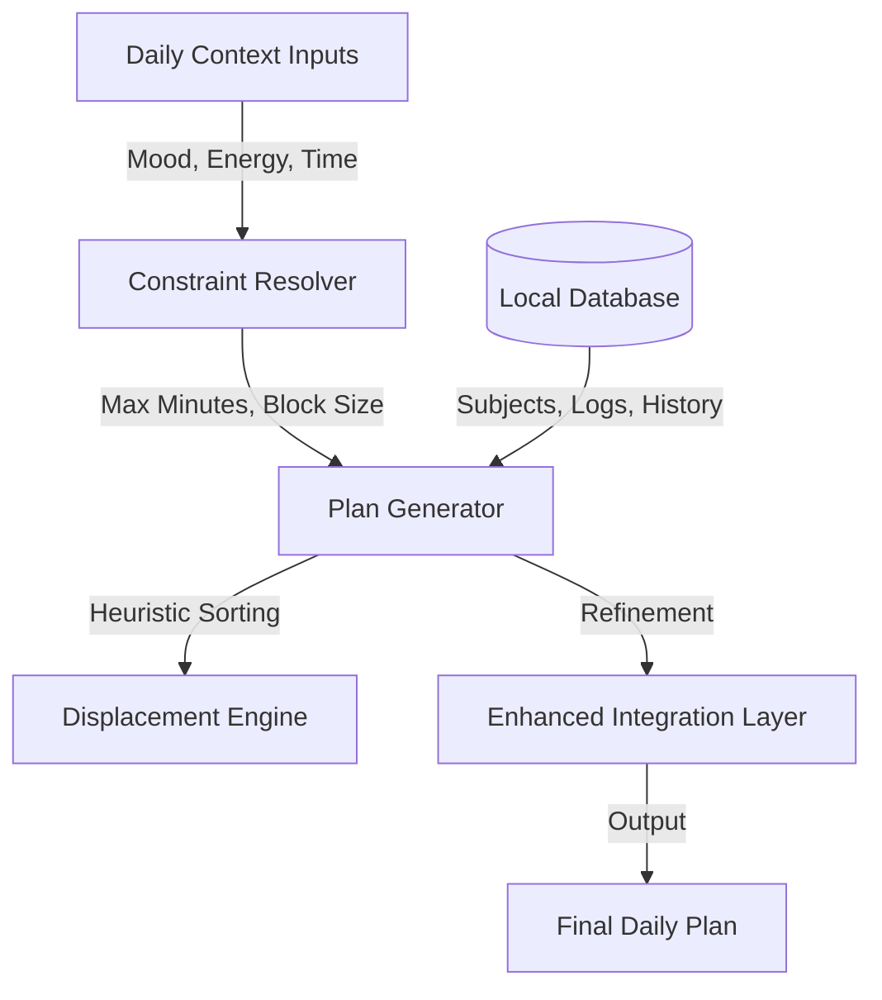

# 🧠 The Orbit Brain: Engineering Context-Aware Study Logic

> **"The calendar is dead. Long live Context."**

The **Orbit Brain** is a deterministic, heuristic-based decision engine that generates study schedules based on *current reality* rather than *idealistic planning*. Unlike traditional calendars that are static, Orbit is **fluid**, re-calculating the entire day's plan in milliseconds based on your energy, mood, and backlog.

---

## 🏗 Architecture Overview

The Brain operates on a **Local-First, Input-Process-Output** model. It runs entirely in the browser (using `Dexie.js` / IndexedDB) to ensure zero latency and complete privacy.



---

## 1. The Daily Context Engine

Before a plan is generated, the user provides the **Daily Context**. This is the "seed" for the generation algorithm.

| Input | Description | Impact on Engine |
| :--- | :--- | :--- |
| **Mood** | `Low`, `Normal`, `High` | Scales total study duration and max blocks (e.g., Low = 90 mins max). |
| **Day Type** | `Normal`, `ISA`, `ESA` | Switches prioritization mode. `ESA` (External Assessment) forces focus on specific subjects. |
| **Energy** | `Morning`, `Afternoon`, `Evening` | Determines *when* high-difficulty blocks are scheduled (via Energy Budgeting). |
| **Bunking** | `Yes/No` | If a user bunks a class, the engine force-inserts a recovery/catch-up block for that subject. |

---

## 2. The Displacement Planner (Core Logic)

Orbit does not "find empty slots." It **fills a bucket** until it overflows, then decides what to keep based on **Dominance Hierarchy**.

### ⚔️ The Dominance Hierarchy
When the day is full, low-priority blocks are engaged in "combat" with new, higher-priority blocks. The winner stays; the loser is displaced to the backlog.

1.  **ESA Focus** (Highest Priority - Exams within 48h)
2.  **Urgent Assignments** (Due < 24h)
3.  **Spaced Repetition Reviews** (Due today)
4.  **Project Decay** (Ignored > 3 days)
5.  **Standard Assignments**
6.  **General Study / Projects** (Lowest Priority)

*Example: If your day is full and an "Urgent Assignment" appears, Orbit will automatically kick out a "General Study" block to make room.*

---

## 3. Enhanced Capabilities (v3 Integration)

The `brain-enhanced-integration.ts` layer wraps the core logic to add human-centric intelligence.

### 🎯 A. Dynamic Difficulty Adjustment (DDA)
The brain analyzes your last 30 days of performance for every subject.
*   **Too Easy?** (Quality consistently 5/5) → **Duration Increased** (+15%)
*   **Too Hard?** (High skip rate) → **Duration Decreased** (-20%)
*   **Outcome**: The plan essentially "breaths" with your capability level.

### 🔋 B. Energy Budget System
Every block is assigned an **Energy Cost** based on:
*   Subject Difficulty (1-5)
*   Duration
*   Task Type (Active Retrieval > Passive Reading)

The engine checks your declared **Energy Profile** (e.g., "I'm a Night Owl"). If you try to schedule heavy calculus at 8 AM when your profile says "Low Energy," the system warns you or reshuffles the block to your peak hours.

### 🧠 C. Interleaving & Neuro-Variety
To prevent cognitive fatigue, the brain enforces **Interleaving Rules**:
*   **Max 2** consecutive blocks of the same subject.
*   **Max 3** consecutive blocks of the same *type* (e.g., Reading).
*   **Variety Score**: A calculated metric ensuring you mix analytical, creative, and memory-based tasks.

### 🔥 D. Burnout Detection
The system silently monitors for "Red Flags" of academic burnout:
*   **Skip Rate** > 30%
*   **Session Ratio** < 0.6 (Quitting early)
*   **Low Mood Streak** > 4 days
*   **No-Study Streak** > 3 days

If detected, Orbit proactively suggests a "Recovery Mode" schedule with reduced load.

---

## 4. Spaced Repetition System (SRS)

Orbit implements a custom variant of the **SM-2 Algorithm** (used by Anki) directly into the schedule.

*   **Comprehension Rating (1-3)**: After every review block, you rate your understanding.
*   **Ease Factor**: Adjusts dynamically. Hard topics appear more often; easy ones are pushed to the future.
*   **Integration**: Unlike Anki (which is just flashcards), Orbit schedules *entire study blocks* based on SRS intervals.

---

## 5. Readiness Score Algorithm

How ready are you for an exam? Orbit quantifies this with a live **Readiness Score (0-100%)**.

```typescript
Readiness = (Volume_Score * 100) * Decay_Factor
```

*   **Volume Score**: Total hours studied vs. Goal (Credits × 10 hours).
*   **Decay Factor**: Exponential decay based on days since last session.
    *   *If you studied 100 hours but stop for 2 weeks, your readiness drops significantly.*

---

## 6. Local-First Data Governance

The "Brain" creates no external footprint.
*   **Storage**: `IndexedDB` (via Dexie.js)
*   **Sync**: None (Currently). Your mental patterns stay on your device.
*   **Privacy**: Complete. No telemetry is sent to the cloud.
