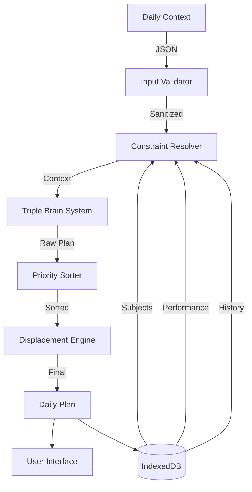

# 🧠 The Orbit Brain v3.0: Technical Deep Dive

> **"The calendar is dead. Long live Context."**

This document provides a comprehensive technical overview of Orbit's triple-brain decision engine. If you're looking for user-facing features, check the [main README](./README.md). This is for developers, contributors, and the technically curious.

---

## Table of Contents

1. [Architecture Philosophy](#architecture-philosophy)
2. [The Triple-Brain System (v3.0)](#the-triple-brain-system-v30)
3. [Data Flow & Processing Pipeline](#data-flow--processing-pipeline)
4. [The Displacement Algorithm](#the-displacement-algorithm)
5. [Heuristic Scoring System](#heuristic-scoring-system)
6. [Performance Tracking & Adaptation](#performance-tracking--adaptation)
7. [Spaced Repetition Implementation](#spaced-repetition-implementation)
8. [Database Schema](#database-schema)
9. [API Reference](#api-reference)

---

## Architecture Philosophy

### Local-First, Deterministic Execution

The Orbit Brain is a **pure function** of your inputs. Given the same:
- Subject database state
- Historical performance data
- Daily context inputs (energy, mood, conditions)

...it will **always** generate the same plan. This determinism enables:
- Reproducible debugging
- Predictable testing
- Zero server dependency
- Instant rollback/replay

### The Input-Process-Output Model



**Key Design Decisions:**
- **No async in core algorithm**: All DB reads happen upfront
- **Immutable data structures**: Plans are never mutated, only replaced
- **Staged refinement**: Each layer adds intelligence without breaking previous stages

---

## The Triple-Brain System (v3.0)

### Overview

Orbit v3.0 introduces a **three-layer brain architecture** that adapts to user data maturity:

```
┌─────────────────────────────────────────────────────┐
│           BRAIN-ULTIMATE (Orchestrator)             │
│  Selects strategy based on user data availability   │
└────────┬────────────────────────────────────┬───────┘
         │                                    │
    ┌────▼────────┐    ┌──────────────┐    ┌▼─────────────┐
    │  Core Brain │    │  Enhanced    │    │  Research    │
    │  (Base)     │───►│  Integration │◄───│  Grade       │
    │             │    │  (Tracking)  │    │  (Advanced)  │
    └─────────────┘    └──────────────┘    └──────────────┘
```

### Layer 1: Core Brain (`brain.ts`)

**Purpose**: Foundation readiness calculations and basic planning

**Features:**
- Subject readiness scoring
- Priority-based block generation
- Basic load analysis
- Displacement logic

**When Used**: Always (base layer for all plans)

### Layer 2: Enhanced Integration (`brain-enhanced-integration.ts`)

**Purpose**: Performance tracking and adaptive adjustments

**Features:**
- Session quality ratings (1-5 scale)
- Burnout detection
- Energy budget management
- Interleaving enforcement
- Performance-based duration tuning

**When Used**: After 5+ days of data

### Layer 3: Research-Grade (`brain-research-grade.ts`)

**Purpose**: Probabilistic models and formal optimization

**Features:**
- Bayesian readiness estimation
- Confidence intervals
- Mastery probability calculations
- Formal gain function optimization
- Variance tracking

**When Used**: After 14+ days of data for full power

### Strategy Selection Logic

```typescript
function selectStrategy(dataSpan: number) {
  if (dataSpan < 5 days) {
    return {
      strategy: 'research',
      confidence: 0.7,
      reason: 'New user - using research-grade with smart defaults'
    };
  } else if (dataSpan < 30 days) {
    return {
      strategy: 'enhanced',
      confidence: 0.8,
      reason: 'Active user - core brain + performance adjustments'
    };
  } else {
    return {
      strategy: 'hybrid',
      confidence: 0.95,
      reason: 'Power user - full research optimization + feedback'
    };
  }
}
```

### Hybrid Mode (30+ Days)

When you have sufficient data, all three layers work together:

1. **Research-Grade** generates initial plan with probabilistic models
2. **Enhanced** applies performance-based adjustments
3. **Core** handles displacement and final constraints

**Result**: Maximum intelligence with 95% confidence

---

## Data Flow & Processing Pipeline

### Stage 1: Context Parsing

**Input Shape:**
```typescript
interface DailyContext {
  mood: 'low' | 'normal' | 'high';
  dayType: 'normal' | 'isa' | 'esa';
  focusSubjectId?: number;
  isHoliday: boolean;
  isSick: boolean;
  bunkedSubjectId?: number;
  daysToExam?: number;
}
```

**Constraint Resolution:**
```typescript
const resolveConstraints = (context: DailyContext) => {
  const baseMinutes = {
    low: 180,      // 3 hours
    normal: 300,   // 5 hours
    high: 420      // 7 hours
  }[context.mood];
  
  const energyLevel = {
    low: 60,
    normal: 80,
    high: 90
  }[context.mood];
  
  return { 
    timeAvailableMinutes: baseMinutes,
    energyLevel 
  };
};
```

### Stage 2: Subject Enrichment

Before generation, each subject is scored on multiple dimensions:

```typescript
interface EnrichedSubject {
  id: string;
  name: string;
  priority: number;          // 1-10 (user-set)
  difficulty: number;        // 1-10 (user-set)
  
  // Computed scores
  decayScore: number;        // Days since last study
  performanceScore: number;  // Recent session quality avg
  
  // Meta
  lastStudied: Date | null;
  totalMinutesLogged: number;
  avgQualityRating: number;  // 1-5 stars
}
```

**Decay Scoring Algorithm:**
```typescript
const calculateDecayScore = (lastStudied: Date | null): number => {
  if (!lastStudied) return 100; // Never studied = max urgency
  
  const daysSince = Math.floor(
    (Date.now() - lastStudied.getTime()) / (1000 * 60 * 60 * 24)
  );
  
  if (daysSince >= 7) return 100;
  if (daysSince >= 5) return 80;
  if (daysSince >= 3) return 60;
  if (daysSince >= 2) return 40;
  return 0;
};
```

### Stage 3: Plan Generation (Brain-Ultimate)

The ultimate orchestrator decides which brain system to use:

```typescript
const generateUltimatePlan = async (context: DailyContext) => {
  // 1. Assess data maturity
  const dataSpan = calculateDataSpan();
  
  // 2. Select strategy
  let blocks: StudyBlock[];
  let confidence: number;
  
  if (dataSpan < 5) {
    // Use research-grade with smart defaults
    const plan = await generateResearchGradePlan(context);
    blocks = plan.blocks;
    confidence = 0.7;
  } else if (dataSpan < 30) {
    // Use core brain + performance adjustments
    const corePlan = await generateDailyPlan(context);
    blocks = await applyPerformanceAdjustments(corePlan.blocks);
    confidence = 0.8;
  } else {
    // Full hybrid: research + performance
    const researchPlan = await generateResearchGradePlan(context);
    blocks = await applyAggressiveAdjustments(researchPlan.blocks);
    confidence = 0.95;
  }
  
  // 3. Compute comprehensive analytics
  const loadAnalysis = {
    burnoutRisk: await detectBurnout(),
    interleaving: analyzeInterleaving(blocks),
    energyBudget: validateEnergyBudget(blocks),
    ...coreMetrics
  };
  
  return { blocks, loadAnalysis, confidence };
};
```

---

## The Displacement Algorithm

### Core Concept: Bucket Overflow Management

Traditional calendars "find slots." Orbit **fills a bucket until overflow**, then uses **priority hierarchy** to decide what stays.

**Priority Tiers (Highest to Lowest):**
```typescript
enum BlockPriority {
  EXAM_TODAY = 1000,         // Exam/ISA/ESA today
  URGENT_ASSIGNMENT = 800,   // Due < 24h
  SRS_DUE_TODAY = 700,       // Spaced repetition reviews
  HIGH_DECAY = 600,          // Ignored > 5 days
  MODERATE_DECAY = 400,      // Ignored 3-5 days
  STANDARD_STUDY = 300,      // Regular subjects
  OPTIONAL_READING = 100     // Background learning
}
```

**Displacement Logic:**
```typescript
const displaceBlocks = (
  blocks: StudyBlock[],
  maxMinutes: number
): StudyBlock[] => {
  // Sort by priority (descending)
  const sorted = [...blocks].sort((a, b) => b.priority - a.priority);
  
  const kept: StudyBlock[] = [];
  const displaced: StudyBlock[] = [];
  let usedMinutes = 0;
  
  for (const block of sorted) {
    if (usedMinutes + block.duration <= maxMinutes) {
      kept.push(block);
      usedMinutes += block.duration;
    } else {
      displaced.push({
        ...block,
        reason: `Time budget exceeded (${usedMinutes}/${maxMinutes} min used)`
      });
    }
  }
  
  console.log(`Kept ${kept.length}, Displaced ${displaced.length} blocks`);
  
  return kept;
};
```

**Visual Example:**
```
Day Capacity: 300 minutes

Initial Queue (by priority):
1. Physics (EXAM_TODAY, 90min)      → KEPT (total: 90)
2. Math (HIGH_DECAY, 60min)         → KEPT (total: 150)
3. Chemistry (MODERATE_DECAY, 90min)→ KEPT (total: 240)
4. History (STANDARD, 60min)        → KEPT (total: 300)
5. Economics (OPTIONAL, 45min)      → DISPLACED (would exceed 300)

Final Plan: 4 blocks, 300 minutes
```

---

## Heuristic Scoring System

### Composite Priority Score Formula

```typescript
const calculateCompositePriority = (subject: EnrichedSubject): number => {
  const weights = {
    userPriority: 10,      // Manual overrides are king
    decayScore: 5,         // Neglect matters
    difficulty: 3,         // Harder = slight boost
    avgQuality: -2         // High performers get less time
  };
  
  return (
    subject.priority * weights.userPriority +
    subject.decayScore * weights.decayScore +
    subject.difficulty * weights.difficulty +
    (5 - subject.avgQualityRating) * weights.avgQuality
  );
};
```

**Why These Weights?**
- **User Priority (10x)**: Respects manual overrides
- **Decay (5x)**: Prevents long-term neglect
- **Difficulty (3x)**: Harder subjects get slight boost
- **Quality (-2x)**: Subjects you're crushing get less time

---

## Performance Tracking & Adaptation

### Dynamic Duration Adjustment

**Goal:** Auto-tune block sizes based on completion patterns

```typescript
const adjustDuration = (
  baselineDuration: number,
  subject: EnrichedSubject,
  recentSessions: Session[]
): number => {
  const last30Days = recentSessions.filter(s => 
    s.subjectId === subject.id &&
    s.timestamp > Date.now() - 30 * 24 * 60 * 60 * 1000
  );
  
  if (last30Days.length < 3) return baselineDuration;
  
  const avgQuality = last30Days.reduce(
    (sum, s) => sum + s.qualityRating, 0
  ) / last30Days.length;
  
  const completionRate = last30Days.filter(
    s => s.completed
  ).length / last30Days.length;
  
  // Too easy: high quality + high completion
  if (avgQuality >= 4.5 && completionRate >= 0.9) {
    return Math.floor(baselineDuration * 1.15); // +15%
  }
  
  // Too hard: low completion or quality
  if (completionRate < 0.6 || avgQuality < 2.5) {
    return Math.floor(baselineDuration * 0.8); // -20%
  }
  
  return baselineDuration; // Just right
};
```

### Burnout Detection

```typescript
interface BurnoutMetrics {
  skipRate: number;          // % of planned sessions skipped
  avgCompletionRate: number; // % of sessions finished
  lowMoodStreak: number;     // Consecutive days mood < 3
}

const detectBurnout = async (): Promise<{
  score: number;
  atRisk: boolean;
  recommendation: string;
}> => {
  const metrics = await calculateBurnoutMetrics();
  
  const redFlags = [
    metrics.skipRate > 0.3,              // 30%+ skip rate
    metrics.avgCompletionRate < 0.6,     // Quitting early often
    metrics.lowMoodStreak > 4            // 4+ days low mood
  ];
  
  const atRisk = redFlags.filter(Boolean).length >= 2;
  
  return {
    score: metrics.skipRate * 100,
    atRisk,
    recommendation: atRisk 
      ? "Consider a rest day or lighter schedule"
      : "Healthy study patterns detected"
  };
};
```

### Interleaving Enforcement

**Goal:** Prevent mental fatigue by mixing subjects and task types

```typescript
const enforceInterleaving = (blocks: StudyBlock[]): StudyBlock[] => {
  const result: StudyBlock[] = [];
  let lastSubjectId: number | null = null;
  let sameSubjectCount = 0;
  
  for (const block of blocks) {
    // Rule: Max 2 consecutive blocks of same subject
    if (block.subjectId === lastSubjectId) {
      sameSubjectCount++;
      if (sameSubjectCount >= 2) {
        // Find different subject to insert
        const different = blocks.find(b => 
          b.subjectId !== lastSubjectId && 
          !result.includes(b)
        );
        if (different) {
          result.push(different);
          lastSubjectId = different.subjectId;
          sameSubjectCount = 1;
          continue;
        }
      }
    } else {
      sameSubjectCount = 1;
    }
    
    result.push(block);
    lastSubjectId = block.subjectId;
  }
  
  return result;
};
```

---

## Spaced Repetition Implementation

### Modified SM-2 Algorithm

Orbit uses a modified **SuperMemo 2** algorithm for review scheduling:

```typescript
interface SRSData {
  easeFactor: number;    // 1.3 - 2.5 (default 2.5)
  interval: number;      // Days until next review
  repetitions: number;   // Total review count
  nextReview: Date;      // Scheduled review date
}

const updateSRS = (
  current: SRSData,
  comprehensionRating: 1 | 2 | 3 // 1=Hard, 2=Good, 3=Easy
): SRSData => {
  let { easeFactor, interval, repetitions } = current;
  
  if (comprehensionRating === 1) {
    // Reset: too hard
    easeFactor = Math.max(1.3, easeFactor - 0.2);
    repetitions = 0;
    interval = 1; // Review tomorrow
  } else {
    // Increase difficulty factor
    easeFactor = Math.min(2.5, 
      easeFactor + (0.1 * (comprehensionRating - 2))
    );
    repetitions++;
    
    // Calculate next interval
    if (repetitions === 1) {
      interval = 1;
    } else if (repetitions === 2) {
      interval = 6;
    } else {
      interval = Math.round(interval * easeFactor);
    }
  }
  
  const nextReview = new Date();
  nextReview.setDate(nextReview.getDate() + interval);
  
  return { easeFactor, interval, repetitions, nextReview };
};
```

---

## Database Schema

### Dexie.js Configuration

```typescript
class OrbitDB extends Dexie {
  semesters!: Table<Semester, number>;
  subjects!: Table<Subject, number>;
  projects!: Table<Project, number>;
  schedule!: Table<ScheduleSlot, number>;
  assignments!: Table<Assignment, string>;
  plans!: Table<DailyPlan, string>;
  logs!: Table<StudyLog, number>;
  topics!: Table<StudyTopic, number>;
  blockOutcomes!: Table<BlockOutcome, string>;
  
  constructor() {
    super('OrbitDB');
    
    this.version(9).stores({
      semesters: '++id',
      subjects: '++id, name, code',
      projects: '++id, subjectId',
      schedule: '++id, day, slot',
      assignments: 'id, subjectId, dueDate',
      plans: 'date',
      logs: '++id, timestamp, date, subjectId',
      topics: '++id, subjectId, nextReview',
      blockOutcomes: '++id, blockId, timestamp, date, completed'
    });
  }
}
```

---

## API Reference

### Core Functions

#### `generateUltimatePlan(context: DailyContext): Promise<UltimatePlanResult>`

Generates a complete daily study plan using the triple-brain system.

**Returns:**
```typescript
{
  blocks: StudyBlock[];
  loadAnalysis: {
    loadScore: number;
    loadLevel: 'light' | 'normal' | 'heavy' | 'extreme';
    burnoutRisk: BurnoutMetrics;
    interleaving: InterleavingAnalysis;
    energyBudget: EnergyBudget;
  };
  planningStrategy: 'core' | 'enhanced' | 'research' | 'hybrid';
  confidence: number; // 0.7 - 0.95
}
```

#### `getUnifiedReadiness(): Promise<Record<number, SubjectReadiness>>`

Gets readiness scores using the best available system.

#### `recordBlockOutcome(outcome: BlockOutcome): Promise<void>`

Records session completion and quality data for learning.

---

## Performance Benchmarks

| Operation | Time (avg) | Notes |
|-----------|-----------|-------|
| Full plan generation | 45-300ms | Varies by strategy |
| Research-grade plan | 50ms | New users |
| Enhanced plan | 150ms | Active users |
| Hybrid plan | 300ms | Power users |
| Database batch load | 120ms | Cold start |

**Target:** All plans under 500ms on mid-range devices.

---

## Future Enhancements

1. **Neural Network Duration Prediction**: Replace heuristics with learned models
2. **Multi-Day Optimization**: Optimize across a week, not just one day
3. **Reinforcement Learning**: Let the system learn optimal strategies
4. **Collaborative Filtering**: Learn from aggregate patterns

---

## Questions?

This document is a living spec. If something is unclear:
1. Check the [main README](./README.md) for user-facing docs
2. Read the source: `brain-ultimate.ts`, `brain.ts`, `brain-enhanced-integration.ts`, `brain-research-grade.ts`
3. Open a [Discussion](https://github.com/santoshcheethirala/orbit/discussions)

**Built with ❤️ by developers who actually study.**