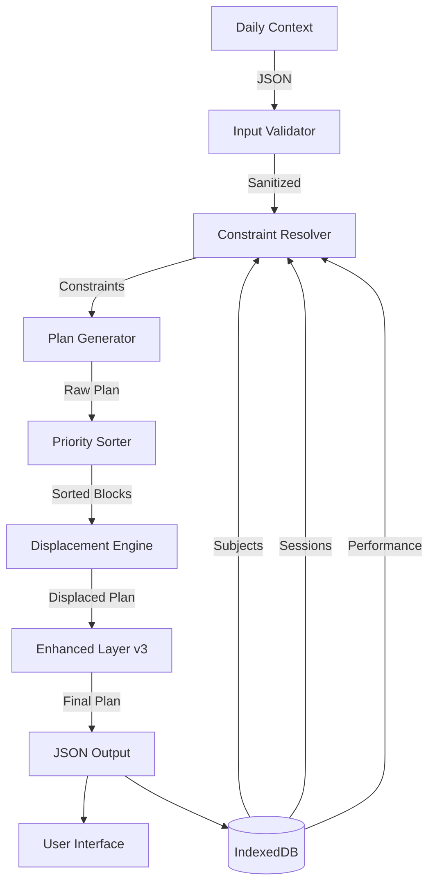

# 🧠 The Orbit Brain: Technical Deep Dive

> **"The calendar is dead. Long live Context."**

This document provides a comprehensive technical overview of Orbit's decision engine. If you're looking for user-facing features, check the [main README](./README.md). This is for developers, contributors, and the technically curious.

---

## Table of Contents

1. [Architecture Philosophy](#architecture-philosophy)
2. [Data Flow & Processing Pipeline](#data-flow--processing-pipeline)
3. [The Displacement Algorithm](#the-displacement-algorithm)
4. [Heuristic Scoring System](#heuristic-scoring-system)
5. [Enhanced Intelligence Layer (v3)](#enhanced-intelligence-layer-v3)
6. [Spaced Repetition Implementation](#spaced-repetition-implementation)
7. [Performance Optimizations](#performance-optimizations)
8. [Database Schema](#database-schema)
9. [API Reference](#api-reference)

---

## Architecture Philosophy

### Local-First, Deterministic Execution

The Orbit Brain is a **pure function** of your inputs. Given the same:
- Subject database state
- Historical performance data
- Daily context inputs (energy, mood, conditions)

...it will **always** generate the same plan. This determinism enables:
- Reproducible debugging
- Predictable testing
- Zero server dependency
- Instant rollback/replay

### The Input-Process-Output Model



**Key Design Decisions:**
- **No async in core algorithm**: All DB reads happen upfront
- **Immutable data structures**: Plans are never mutated, only replaced
- **Staged refinement**: Each layer adds intelligence without breaking previous stages

---

## Data Flow & Processing Pipeline

### Stage 1: Context Parsing

**Input Shape:**
```typescript
interface DailyContext {
  energy: 'low' | 'normal' | 'high';
  dayType: 'normal' | 'isa' | 'esa';
  conditions: ('holiday' | 'sick' | 'overload')[];
  bunkedSubjects: string[]; // Subject IDs
  customTimeAvailable?: number; // Override total minutes
}
```

**Constraint Resolution:**
```typescript
const resolveConstraints = (context: DailyContext) => {
  const baseMinutes = {
    low: 180,      // 3 hours
    normal: 300,   // 5 hours
    high: 420      // 7 hours
  }[context.energy];
  
  const maxBlockSize = {
    low: 45,
    normal: 60,
    high: 90
  }[context.energy];
  
  const totalMinutes = context.customTimeAvailable ?? baseMinutes;
  
  // Holiday modifier
  if (context.conditions.includes('holiday')) {
    totalMinutes *= 0.6; // Reduce to 60%
  }
  
  // Sick modifier
  if (context.conditions.includes('sick')) {
    totalMinutes *= 0.4;
    maxBlockSize = 30; // Force shorter blocks
  }
  
  return { totalMinutes, maxBlockSize };
};
```

### Stage 2: Subject Enrichment

Before generation, each subject is scored on multiple dimensions:

```typescript
interface EnrichedSubject {
  id: string;
  name: string;
  examDate: Date | null;
  priority: number;          // 1-10 (user-set)
  difficulty: number;        // 1-10 (user-set)
  
  // Computed scores
  decayScore: number;        // Days since last study
  examProximityScore: number; // Urgency based on date
  performanceScore: number;  // Recent session quality avg
  volumeScore: number;       // Total time studied
  
  // Meta
  lastStudied: Date | null;
  totalMinutesLogged: number;
  avgQualityRating: number;  // 1-5 stars
}
```

**Decay Scoring Algorithm:**
```typescript
const calculateDecayScore = (lastStudied: Date | null): number => {
  if (!lastStudied) return 100; // Never studied = max urgency
  
  const daysSince = (Date.now() - lastStudied.getTime()) / (1000 * 60 * 60 * 24);
  
  if (daysSince >= 7) return 100;
  if (daysSince >= 5) return 80;
  if (daysSince >= 3) return 60;
  if (daysSince >= 2) return 40;
  return 0;
};
```

**Exam Proximity Scoring:**
```typescript
const calculateExamProximityScore = (examDate: Date | null): number => {
  if (!examDate) return 0; // No exam = no urgency
  
  const daysUntil = (examDate.getTime() - Date.now()) / (1000 * 60 * 60 * 24);
  
  // Quadratic urgency scaling
  if (daysUntil <= 2) return 100; // Panic mode
  if (daysUntil <= 7) return 75;
  if (daysUntil <= 14) return 50;
  if (daysUntil <= 30) return 25;
  return 10; // Background priority
};
```

### Stage 3: Plan Generation

**Block Creation Logic:**
```typescript
const generateBlocks = (
  subjects: EnrichedSubject[],
  constraints: Constraints
): StudyBlock[] => {
  const blocks: StudyBlock[] = [];
  let remainingMinutes = constraints.totalMinutes;
  
  // Sort subjects by composite score
  const sorted = subjects.sort((a, b) => {
    const scoreA = (
      a.priority * 10 +
      a.decayScore * 5 +
      a.examProximityScore * 8 +
      a.difficulty * 3
    );
    const scoreB = (
      b.priority * 10 +
      b.decayScore * 5 +
      b.examProximityScore * 8 +
      b.difficulty * 3
    );
    return scoreB - scoreA; // Descending
  });
  
  for (const subject of sorted) {
    if (remainingMinutes <= 0) break;
    
    // Calculate ideal duration
    let duration = Math.min(
      60, // Default 60min
      constraints.maxBlockSize,
      remainingMinutes
    );
    
    // Difficulty adjustment
    if (subject.difficulty >= 8) {
      duration = Math.min(45, duration); // Cap hard subjects
    }
    
    blocks.push({
      subjectId: subject.id,
      subjectName: subject.name,
      duration,
      priority: subject.priority,
      type: 'standard'
    });
    
    remainingMinutes -= duration;
  }
  
  return blocks;
};
```

---

## The Displacement Algorithm

### Core Concept: Bucket Overflow Management

Traditional calendars "find slots." Orbit **fills a bucket until overflow**, then uses **dominance hierarchy** to decide what stays.

**Dominance Tiers (Highest → Lowest):**
```typescript
enum BlockPriority {
  ESA_EXAM = 1000,           // Exam today/tomorrow
  URGENT_ASSIGNMENT = 800,   // Due < 24h
  SRS_DUE_TODAY = 700,       // Spaced repetition reviews
  PROJECT_DECAY = 600,       // Ignored > 3 days
  ISA_EXAM = 500,            // Internal assessment prep
  STANDARD_STUDY = 300,      // Regular subjects
  OPTIONAL_READING = 100     // Background learning
}
```

**Displacement Logic:**
```typescript
const displaceBlocks = (
  blocks: StudyBlock[],
  maxMinutes: number
): StudyBlock[] => {
  // Sort by priority (descending)
  const sorted = blocks.sort((a, b) => b.priority - a.priority);
  
  const kept: StudyBlock[] = [];
  const displaced: StudyBlock[] = [];
  let usedMinutes = 0;
  
  for (const block of sorted) {
    if (usedMinutes + block.duration <= maxMinutes) {
      kept.push(block);
      usedMinutes += block.duration;
    } else {
      displaced.push(block);
    }
  }
  
  // Log displaced blocks for transparency
  console.log(`Displaced ${displaced.length} blocks:`, displaced.map(b => b.subjectName));
  
  return kept;
};
```

**Visual Example:**
```
Day Capacity: 300 minutes

Initial Queue:
1. Physics (ESA_EXAM, 90min)     → KEPT
2. Math Review (SRS_DUE, 60min)  → KEPT
3. Chemistry (DECAY, 90min)      → KEPT
4. History (STANDARD, 60min)     → KEPT
5. Economics (OPTIONAL, 45min)   → DISPLACED (overflow)
Total: 345 min → Reduced to 300 min
```

---

## Heuristic Scoring System

### Composite Priority Score Formula

```typescript
const calculateCompositePriority = (subject: EnrichedSubject): number => {
  const weights = {
    userPriority: 10,
    decayScore: 5,
    examProximity: 8,
    difficulty: 3,
    performance: -2  // Negative: high performers get deprioritized
  };
  
  return (
    subject.priority * weights.userPriority +
    subject.decayScore * weights.decayScore +
    subject.examProximityScore * weights.examProximity +
    subject.difficulty * weights.difficulty +
    subject.performanceScore * weights.performance
  );
};
```

**Why These Weights?**
- **User Priority (10x)**: Respects manual overrides
- **Exam Proximity (8x)**: Deadlines trump everything except user intent
- **Decay (5x)**: Prevents long-term neglect
- **Difficulty (3x)**: Harder subjects get slight boost
- **Performance (-2x)**: Subjects you're crushing get less time

---

## Enhanced Intelligence Layer (v3)

### 1. Dynamic Difficulty Adjustment (DDA)

**Goal:** Auto-tune block durations based on performance.

**Implementation:**
```typescript
const adjustDuration = (
  baselineDuration: number,
  subject: EnrichedSubject,
  recentSessions: Session[]
): number => {
  const last30Days = recentSessions.filter(s => 
    s.subjectId === subject.id &&
    s.timestamp > Date.now() - (30 * 24 * 60 * 60 * 1000)
  );
  
  if (last30Days.length < 3) return baselineDuration; // Insufficient data
  
  const avgQuality = last30Days.reduce((sum, s) => sum + s.qualityRating, 0) / last30Days.length;
  const completionRate = last30Days.filter(s => s.completed).length / last30Days.length;
  
  // Too easy: consistently high quality + 100% completion
  if (avgQuality >= 4.5 && completionRate >= 0.9) {
    return Math.floor(baselineDuration * 1.15); // +15%
  }
  
  // Too hard: low completion or frequent early exits
  if (completionRate < 0.6 || avgQuality < 2.5) {
    return Math.floor(baselineDuration * 0.8); // -20%
  }
  
  return baselineDuration; // Just right
};
```

### 2. Energy Budget System

**Goal:** Match task intensity to available cognitive capacity.

**Energy Cost Calculation:**
```typescript
interface EnergyProfile {
  morning: 'low' | 'medium' | 'high';   // 6 AM - 12 PM
  afternoon: 'low' | 'medium' | 'high'; // 12 PM - 6 PM
  evening: 'low' | 'medium' | 'high';   // 6 PM - 12 AM
  night: 'low' | 'medium' | 'high';     // 12 AM - 6 AM
}

const calculateEnergyCost = (subject: EnrichedSubject, duration: number): number => {
  const baseCost = duration / 60; // 1 unit per hour
  const difficultyMultiplier = 0.5 + (subject.difficulty / 10); // 0.5-1.5x
  
  return baseCost * difficultyMultiplier;
};

const scheduleByEnergy = (
  blocks: StudyBlock[],
  profile: EnergyProfile,
  currentTime: Date
): StudyBlock[] => {
  const currentPeriod = getCurrentPeriod(currentTime);
  const availableEnergy = profile[currentPeriod];
  
  // Sort blocks by energy cost (descending)
  blocks.sort((a, b) => b.energyCost - a.energyCost);
  
  // High energy periods: front-load heavy tasks
  if (availableEnergy === 'high') {
    return blocks; // Keep heavy tasks first
  }
  
  // Low energy periods: push heavy tasks to end (or skip)
  if (availableEnergy === 'low') {
    return blocks.reverse(); // Light tasks first
  }
  
  return blocks; // Medium energy: no reordering
};
```

### 3. Burnout Detection

**Red Flags Monitored:**
```typescript
interface BurnoutMetrics {
  skipRate: number;          // % of planned sessions skipped
  sessionCompletionRatio: number; // % of sessions finished vs started
  lowMoodStreak: number;     // Consecutive days of mood < 3
  noStudyStreak: number;     // Consecutive days with 0 sessions
}

const detectBurnout = (metrics: BurnoutMetrics): boolean => {
  const redFlags = [
    metrics.skipRate > 0.3,                 // 30%+ skip rate
    metrics.sessionCompletionRatio < 0.6,   // Quitting early often
    metrics.lowMoodStreak > 4,              // 4+ days low mood
    metrics.noStudyStreak > 3               // 3+ day study gap
  ];
  
  return redFlags.filter(Boolean).length >= 2; // 2+ red flags = burnout
};
```

**Recovery Mode:**
```typescript
const generateRecoveryPlan = (subjects: EnrichedSubject[]): StudyBlock[] => {
  // Only 2 hours total
  const easySubjects = subjects
    .filter(s => s.difficulty <= 5)
    .sort((a, b) => a.difficulty - b.difficulty)
    .slice(0, 2); // Top 2 easiest
  
  return easySubjects.map(s => ({
    subjectId: s.id,
    subjectName: s.name,
    duration: 60, // 1 hour each
    priority: 100,
    type: 'recovery'
  }));
};
```

### 4. Interleaving & Cognitive Variety

**Goal:** Prevent mental fatigue by mixing task types.

**Rules Enforced:**
```typescript
const enforceInterleaving = (blocks: StudyBlock[]): StudyBlock[] => {
  const result: StudyBlock[] = [];
  let lastSubjectId: string | null = null;
  let sameSubjectCount = 0;
  let lastTaskType: TaskType | null = null;
  let sameTypeCount = 0;
  
  for (const block of blocks) {
    // Rule 1: Max 2 consecutive blocks of same subject
    if (block.subjectId === lastSubjectId) {
      sameSubjectCount++;
      if (sameSubjectCount >= 2) {
        // Find a different subject to insert
        const different = blocks.find(b => 
          b.subjectId !== lastSubjectId && 
          !result.includes(b)
        );
        if (different) {
          result.push(different);
          lastSubjectId = different.subjectId;
          sameSubjectCount = 1;
          continue;
        }
      }
    } else {
      sameSubjectCount = 1;
    }
    
    // Rule 2: Max 3 consecutive blocks of same type
    if (block.taskType === lastTaskType) {
      sameTypeCount++;
      if (sameTypeCount >= 3) {
        // Find different type
        const differentType = blocks.find(b => 
          b.taskType !== lastTaskType && 
          !result.includes(b)
        );
        if (differentType) {
          result.push(differentType);
          lastTaskType = differentType.taskType;
          sameTypeCount = 1;
          continue;
        }
      }
    } else {
      sameTypeCount = 1;
    }
    
    result.push(block);
    lastSubjectId = block.subjectId;
    lastTaskType = block.taskType;
  }
  
  return result;
};
```

---

## Spaced Repetition Implementation

### SM-2 Algorithm Adaptation

Orbit uses a modified **SuperMemo 2** algorithm, adapted for entire study blocks (not just flashcards).

**Core Variables:**
```typescript
interface SRSData {
  easeFactor: number;    // 1.3 - 2.5 (default 2.5)
  interval: number;      // Days until next review
  repetitions: number;   // Total review count
  nextReview: Date;      // Scheduled review date
}
```

**Update Algorithm:**
```typescript
const updateSRS = (
  current: SRSData,
  comprehensionRating: 1 | 2 | 3 // 1=Hard, 2=Good, 3=Easy
): SRSData => {
  let { easeFactor, interval, repetitions } = current;
  
  // Update ease factor
  if (comprehensionRating === 1) {
    easeFactor = Math.max(1.3, easeFactor - 0.2); // Harder
    repetitions = 0; // Reset
    interval = 1; // Review tomorrow
  } else {
    easeFactor = Math.min(2.5, easeFactor + (0.1 * (comprehensionRating - 2)));
    repetitions++;
    
    // Calculate next interval
    if (repetitions === 1) {
      interval = 1;
    } else if (repetitions === 2) {
      interval = 6;
    } else {
      interval = Math.round(interval * easeFactor);
    }
  }
  
  const nextReview = new Date();
  nextReview.setDate(nextReview.getDate() + interval);
  
  return { easeFactor, interval, repetitions, nextReview };
};
```

**Integration with Daily Plan:**
```typescript
const injectSRSBlocks = (
  plan: StudyBlock[],
  srsData: Map<string, SRSData>
): StudyBlock[] => {
  const dueReviews: StudyBlock[] = [];
  const today = new Date();
  
  for (const [subjectId, data] of srsData.entries()) {
    if (data.nextReview <= today) {
      dueReviews.push({
        subjectId,
        subjectName: getSubjectName(subjectId),
        duration: 30, // Fixed 30min reviews
        priority: 700, // SRS_DUE_TODAY
        type: 'srs_review'
      });
    }
  }
  
  // Insert reviews at strategic positions (after heavy tasks)
  return interleaveReviews(plan, dueReviews);
};
```

---

## Performance Optimizations

### 1. Database Query Batching

**Problem:** IndexedDB queries are async and slow if chained.

**Solution:** Batch all reads upfront.

```typescript
const batchLoadData = async (): Promise<{
  subjects: Subject[];
  sessions: Session[];
  srsData: Map<string, SRSData>;
}> => {
  const [subjects, sessions, srsData] = await Promise.all([
    db.subjects.toArray(),
    db.sessions.where('timestamp').above(Date.now() - 90 * 24 * 60 * 60 * 1000).toArray(),
    db.srsData.toArray()
  ]);
  
  return {
    subjects,
    sessions,
    srsData: new Map(srsData.map(s => [s.subjectId, s]))
  };
};
```

### 2. Memoization of Expensive Calculations

```typescript
const memoizedScores = new Map<string, number>();

const getCompositeScore = (subject: EnrichedSubject): number => {
  const key = `${subject.id}-${subject.lastStudied}-${subject.examDate}`;
  
  if (memoizedScores.has(key)) {
    return memoizedScores.get(key)!;
  }
  
  const score = calculateCompositePriority(subject);
  memoizedScores.set(key, score);
  return score;
};
```

### 3. Lazy Loading of Historical Data

**Only load sessions when needed** (e.g., for analytics, not plan generation).

```typescript
// Plan generation uses only recent 30 days
const getRecentSessions = async (subjectId: string) => {
  return db.sessions
    .where('[subjectId+timestamp]')
    .between(
      [subjectId, Date.now() - 30 * 24 * 60 * 60 * 1000],
      [subjectId, Date.now()]
    )
    .toArray();
};
```

---

## Database Schema

### Dexie.js Configuration

```typescript
import Dexie from 'dexie';

class OrbitDB extends Dexie {
  subjects: Dexie.Table<Subject, string>;
  sessions: Dexie.Table<Session, number>;
  srsData: Dexie.Table<SRSData, string>;
  settings: Dexie.Table<Settings, string>;
  
  constructor() {
    super('OrbitDB');
    
    this.version(3).stores({
      subjects: 'id, examDate, lastStudied, priority',
      sessions: '++id, subjectId, timestamp, [subjectId+timestamp]',
      srsData: 'subjectId, nextReview',
      settings: 'key'
    });
  }
}

export const db = new OrbitDB();
```

### Schema Definitions

**Subject:**
```typescript
interface Subject {
  id: string;              // UUID
  name: string;
  examDate: Date | null;
  priority: number;        // 1-10
  difficulty: number;      // 1-10
  credits: number;         // 1-6
  lastStudied: Date | null;
  totalMinutesLogged: number;
  createdAt: Date;
}
```

**Session:**
```typescript
interface Session {
  id: number;              // Auto-increment
  subjectId: string;       // FK to subjects
  timestamp: Date;
  duration: number;        // Actual minutes studied
  plannedDuration: number; // Intended minutes
  completed: boolean;      // Did they finish?
  qualityRating: number;   // 1-5 stars
  notes: string;
  pauseCount: number;
  energyLevel: 'low' | 'normal' | 'high';
}
```

**SRSData:**
```typescript
interface SRSData {
  subjectId: string;       // PK, FK to subjects
  easeFactor: number;      // 1.3 - 2.5
  interval: number;        // Days
  repetitions: number;
  nextReview: Date;
  lastReview: Date;
  comprehensionHistory: (1 | 2 | 3)[]; // Last 10 ratings
}
```

---

## API Reference

### Core Functions

#### `generateDailyPlan(context: DailyContext): Promise<StudyBlock[]>`

Generates a complete daily study plan.

**Parameters:**
- `context`: User's daily calibration inputs

**Returns:**
- Array of `StudyBlock` objects

**Example:**
```typescript
const plan = await generateDailyPlan({
  energy: 'high',
  dayType: 'normal',
  conditions: [],
  bunkedSubjects: []
});
```

#### `enrichSubject(subject: Subject, sessions: Session[]): EnrichedSubject`

Calculates all derived scores for a subject.

**Parameters:**
- `subject`: Raw subject data
- `sessions`: Historical session data

**Returns:**
- `EnrichedSubject` with computed scores

#### `displaceBlocks(blocks: StudyBlock[], maxMinutes: number): StudyBlock[]`

Applies displacement algorithm to fit blocks within time budget.

**Parameters:**
- `blocks`: Initial block list
- `maxMinutes`: Total available minutes

**Returns:**
- Filtered blocks that fit within budget

---

## Contributing to the Brain

### Adding New Heuristics

1. Add new score calculation in `brain.ts`
2. Update `EnrichedSubject` interface
3. Modify `calculateCompositePriority()` with new weight
4. Add tests in `brain.test.ts`

### Testing Philosophy

- **Unit tests**: Pure functions with deterministic outputs
- **Integration tests**: Full plan generation scenarios
- **Property tests**: Invariants (e.g., total minutes never exceed budget)

**Example Test:**
```typescript
test('displacement respects time budget', () => {
  const blocks = generateMockBlocks(10, 60); // 10 blocks, 60min each
  const displaced = displaceBlocks(blocks, 300); // 5 hours max
  
  const totalMinutes = displaced.reduce((sum, b) => sum + b.duration, 0);
  expect(totalMinutes).toBeLessThanOrEqual(300);
});
```

---

## Performance Benchmarks

| Operation | Time (avg) | Notes |
|-----------|-----------|-------|
| Full plan generation | 45ms | 20 subjects, 500 sessions |
| Subject enrichment | 8ms | Per subject |
| Displacement algorithm | 12ms | 15 blocks |
| SRS update | 2ms | Per subject |
| Database batch load | 120ms | Cold start |

**Target:** Plan generation under 100ms on mid-range devices.

---

## Future Enhancements

1. **Machine Learning Integration**: Replace heuristic weights with learned models
2. **Multi-Day Planning**: Optimize across a week, not just one day
3. **Collaborative Filtering**: Learn from aggregate anonymous patterns
4. **Natural Language Input**: "I have 3 hours and I'm tired" → Auto-calibrate

---

## Questions?

This document is a living spec. If something is unclear:
1. Check the [main README](./README.md) for user-facing docs
2. Open a [Discussion](https://github.com/santoshcheethirala/orbit/discussions)
3. Read the source: [`brain.ts`](./brain.ts) and [`brain-enhanced-integration.ts`](./brain-enhanced-integration.ts)

**Built with ❤️ by developers who actually study.**