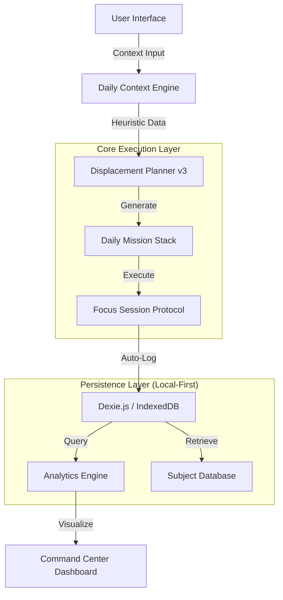

# 🛰️ Orbit v3


> **Mission Control for Students. An energy-aware, local-first study execution system built for those who don't live by rigid calendars.**

---

## 🧠 The Philosophy: Context over Calendar

Traditional planners fail because they assume every day is the same. **Orbit** is built on the reality of student life: inconsistent energy, late-night study streaks, and shifting academic priorities.

### 🌌 The Night-Owl Principle
Most planners reset at midnight—breaking your flow. Orbit features a **configurable day-start threshold** (default: 4:00 AM). Studying at 3:30 AM still counts as "today," preserving your focus streaks and mental momentum.

---

## 🏗 System Architecture

Orbit utilizes a **Local-First Architecture**, ensuring 100% offline functionality and zero-latency interactions by keeping the entire database on the client side.



---

## 🚀 Core Systems

### 1. Daily Context Engine
Every day begins with a **Calibration Step**. Instead of a static schedule, you feed the engine your current reality:
*   **Energy Level**: Low / Normal / High
*   **Day Type**: Normal / ISA (Internal) / ESA (External)
*   **Conditions**: Holiday, sick, or unexpected workload.

### 2. Adaptive Displacement Planner
Orbit’s engine converts your context into variable study blocks using a multi-factor prioritization system:
*   **Project Decay Detection**: Automatically escalates subjects neglected for 3+ days.
*   **Exam Proximity**: Dynamically increases "Dominance Priority" as deadlines approach.
*   **Workload Analysis**: Visualizes 4 levels of load (Light to Extreme) with overload warnings.

### 3. Focus Session Protocol
A tactile, distraction-free environment for execution.
*   **State Preservation**: Pause and resume without losing progress.
*   **Microinteractions**: Woodblock tap audio (300Hz) and glass chime success alerts.
*   **Session Reflections**: Integrated glass-morphism notes for immediate feedback capture.

---

## 🛠 Tech Stack

| Domain | Technology | Reason for Choice |
| --- | --- | --- |
| **Frontend** | **React 19** | Concurrent rendering for ultra-responsive UI updates. |
| **Type Safety** | **TypeScript** | Strict typing for complex mission-generation logic. |
| **Storage** | **Dexie.js (IndexedDB)** | Robust local-first persistence with zero cloud dependency. |
| **Styling** | **Tailwind CSS** | Radical design flexibility for the space-themed glassmorphism UI. |
| **Build Tool** | **Vite 6** | Instant HMR and high-performance production bundling. |
| **Icons** | **Lucide React** | Clean, minimalist vector iconography. |

---

## 📂 Project Blueprint

A scalable, logic-first directory structure.

```bash
orbitv2/
├── app/                  # Application Core
│   ├── Dashboard.tsx     # Command Center (Operational View)
│   ├── Courses.tsx       # Subject Hub & Resource Management
│   ├── Stats.tsx         # Analytical Engine & Focus Scoring
│   └── FocusSession.tsx  # Execution Protocol Layer
├── components/           # UI Components
│   ├── ui/               # Primary design primitives
│   └── SpaceBackground.tsx # Interactive physics-based canvas
├── lib/                  # Engineering Utilities
│   ├── brain.ts          # Core Heuristic Algorithm
│   ├── db.ts             # Dexie Schema & Migrations
│   └── tracking.ts       # Performance & Activity Logging
└── public/               # Service Workers & Static Assets
```

---

## 📦 Installation & Setup

Ensure you have **Node.js 18+** installed.

```bash
# 1. Clone the repository
git clone https://github.com/santoshcheethirala/orbit.git

# 2. Install dependencies
npm install

# 3. Start development server
npm run dev
```

---

## 🗺 Roadmap

*   **Phase 1**: Stability & Performance Profiling (Q1 2026)
*   **Phase 2**: Spaced Repetition (Ebbinghaus Curve) Integration (Q2 2026)
*   **Phase 3**: End-to-End Encrypted Cloud Sync (Optional) (Q3 2026)

---

## 🔒 Privacy & Data Governance
Orbit is **Local-First by Design**. Your data never leaves your device. No accounts, no telemetry, no external trackers. You own your academic history—permanently.

---

**Built with ❤️ for Night Owls by [Santosh Cheethirala](https://github.com/santoshcheethirala)**
*Engineering Intelligently Adaptive Interfaces*

