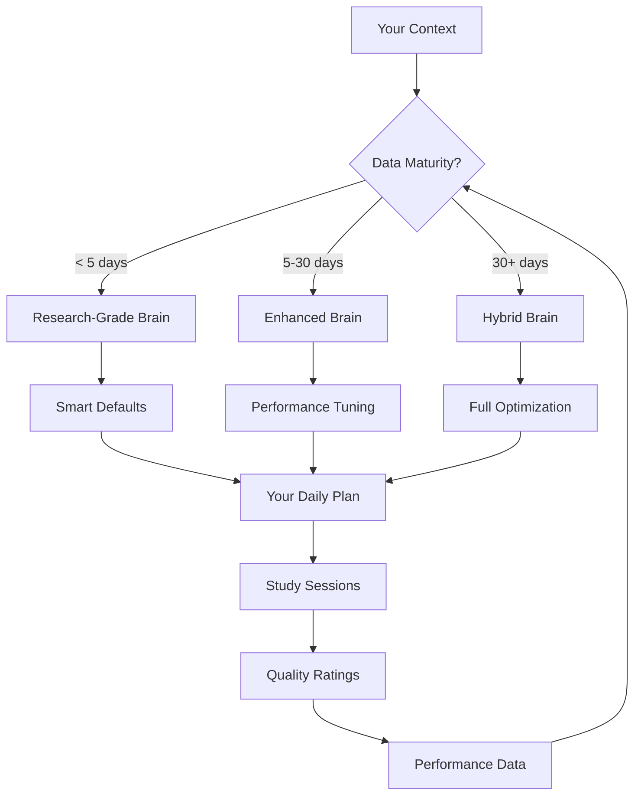

<div align="center">

# 🛰️ Orbit v3.2

> **The specialized planning intelligence for high-performance students.**

Orbit is not just a todo list. It is a **focus engine** designed to maximize deep work, enforce rest, and adapt to your energy levels. It uses a triple-brain AI architecture to plan your day, predict burnouts, and guide you through complex subjects.

## 🚀 New in v3.2
- **AI Insight Banner**: Personalized daily coaching messages powered by OpenRouter — warns of decay, suggests quick wins, and motivates based on real session patterns.
- **Typewriter UI**: Insights render with a typewriter effect and session-level caching so they don't re-fetch on every render.
- **Exam & Settings Tables**: DB upgraded to v11 with dedicated `exams` and `settings` tables for persistent user preferences and exam schedule tracking.

## ✨ What's New in v3.1
- **Mechanical Flip Clock**: A hyper-realistic 3D flip timer for focus sessions with sub-millisecond precision.
- **AI Study Assistant**: A spring-animated, GPU-accelerated modal for instant study guidance and topic breakdown.
- **Fluid UI Core**: Global smooth scrolling, optimized transitions, and enhanced light/dark mode fluidity.
- **Data Hardening**: Robust local persistence with snapshot recovery and multi-tab synchronization.

[](https://react.dev/)
[](https://www.typescriptlang.org/)
[](/)
[](/)

[Try Demo](#-quick-start) • [Features](#-what-makes-orbit-different) • [How It Works](./BRAIN.md) • [Install](#-installation)

---

</div>

## ✨ What's New in v3.0

### 🧠 Triple-Brain AI System
Orbit uses **three integrated intelligence layers** that work together:

1. **Core Brain** - Readiness calculations & priority-based planning
2. **Enhanced Integration** - Performance tracking, energy management, quality ratings  
3. **Research-Grade** - Probabilistic models & formal optimization algorithms

**Adaptive Strategy Selection:**
- **New users (< 5 days)**: Research-grade algorithms with smart defaults
- **Active users (5-30 days)**: Enhanced performance-based adjustments
- **Power users (30+ days)**: Full hybrid optimization with ML feedback

### 🎯 New Features
- ✅ **Import/Export Backup System** - Seamless device switching
- ✅ **Confidence Scoring** - See how confident the AI is in your plan (70-95%)
- ✅ **Performance Adjustments** - Block durations auto-tune based on your history
- ✅ **Comprehensive Load Analysis** - Burnout risk, interleaving, energy budgets
- ✅ **Quality Rating System** - Rate session quality (1-5 scale) for better predictions

---

## 🎨 What Makes Orbit Different

<table>
<tr>
<td width="50%">

### 🧠 AI That Learns You
- **Adaptive Block Sizing**: Struggling? Get shorter, focused sessions automatically
- **Energy Matching**: Heavy tasks scheduled during your peak hours
- **Burnout Detection**: Proactive recovery suggestions before you crash
- **Quality Tracking**: Rate each session to improve future predictions

</td>
<td width="50%">

### 🎯 Smart Prioritization
- **Decay Detection**: Auto-escalates subjects ignored 3+ days
- **Exam Proximity Engine**: Quadratic urgency scaling
- **Daily Context Calibration**: Energy + Deadlines = Optimal plan
- **Performance Feedback**: Block sizes adjust based on completion rates

</td>
</tr>
<tr>
<td>

### ⚡ Zero Friction Execution
- **One-Click Focus Mode**: Full-screen, distraction-free
- **Session Reflections**: Rate quality, capture insights instantly
- **Configurable "Day Start"**: 4 AM default (for night owls)
- **Import/Export**: Switch devices seamlessly

</td>
<td>

### 🔒 100% Private & Offline
- **Local-First**: Data never leaves your device
- **No Accounts**: No sign-ups, no tracking
- **Instant**: 0ms latency, works offline
- **Export Anytime**: You own your data

</td>
</tr>
</table>

---

## 🚀 Quick Start

```bash
# Clone & Run (60 seconds)
git clone https://github.com/santoshcheethirala/orbit.git
cd orbit
npm install && npm run dev

# Open http://localhost:5173
```

**First Session:**
1. Add subjects (Courses tab)
2. Calibrate your day (Dashboard - Set context: energy/mood)
3. Start a focus session (Pick a mission - Focus)
4. Rate your session quality (helps the AI learn)

That's it. No tutorials. No setup hell.

---

## 🎯 Core Features

| Feature | What It Does | Why It Matters |
|---------|-------------|----------------|
| **Triple-Brain System** | 3 AI layers working together | Plans get smarter as you use Orbit |
| **AI Insight Banner** | OpenRouter-powered daily coaching card | Warns decay, suggests quick wins, motivates |
| **Daily Context Engine** | Calibrate energy/mood before generating plan | Plans match reality, not fantasy |
| **Adaptive Displacement** | Auto-reschedules based on changing priorities | Exams don't sneak up on you |
| **Focus Session Protocol** | Distraction-free, full-screen study mode | Preserves flow state, tracks quality |
| **Performance Tracking** | Quality ratings & completion analytics | AI tunes block sizes to your patterns |
| **Spaced Repetition** | Ebbinghaus curve-based review scheduling | Actually retain what you learn |
| **AI Study Assistant** | Claude/OpenRouter-powered concept clarification | Get unstuck instantly |
| **Analytics Dashboard** | Focus scores, streaks, subject heatmaps | See patterns, adjust strategy |
| **Import/Export** | Backup/restore your entire study history | Never lose your data |

---

## 🧠 The Triple-Brain System

### How It Works


```mermaid
graph TD
    A[Your Context] --> B{Data Maturity?}
    B -->|< 5 days| C[Research-Grade Brain]
    B -->|5-30 days| D[Enhanced Brain]
    B -->|30+ days| E[Hybrid Brain]
    
    C --> F[Smart Defaults]
    D --> G[Performance Tuning]
    E --> H[Full Optimization]
    
    F --> I[Your Daily Plan]
    G --> I
    H --> I
    
    I --> J[Study Sessions]
    J --> K[Quality Ratings]
    K --> L[Performance Data]
    L --> B
```

### Confidence Levels
- **70%**: New user, using research algorithms
- **80%**: Active user, enhanced with performance data
- **95%**: Power user, full hybrid optimization

**Deep Dive:** [Read BRAIN.md](./BRAIN.md) for algorithm details, heuristics, and technical architecture.

---

## 🛠️ Built With

```typescript
Frontend:    React 19 + TypeScript 5.8
Database:    Dexie.js (IndexedDB wrapper) — v11 schema
Styling:     Tailwind CSS
Build:       Vite 6.2
AI:          OpenRouter (insight banner, study assistant)
Brain:       Custom algorithms + research-grade models
```

**Why Local-First?**
- ⚡ **Instant** - 0ms latency on every action
- 🔒 **Private** - Your study patterns stay on your device
- 💰 **Free** - No subscriptions, no cloud costs
- ✈️ **Offline** - Works on planes, trains, no WiFi needed

---

## 🎯 Perfect For

- 🌙 **Night owls** who study best after midnight
- 🔥 **Crammers** who need intelligent panic-mode planning
- 🧠 **STEM students** juggling heavy, interconnected subjects
- 📊 **Data nerds** who want analytics on their study patterns
- 🔒 **Privacy advocates** who hate cloud dependency
- 🎓 **Power users** who want AI that learns their patterns

---

## 💡 Why Blocks Instead of Time Slots?

Traditional planners force you into rigid time slots:
- ❌ "Study Math 2-4 PM" - What if you're tired at 2 PM?
- ❌ "Review Physics Monday" - What if there's a surprise quiz Tuesday?
- ❌ "30 min per subject" - What if you need 60 min for hard topics?

**Orbit uses "Study Blocks" instead:**
- ✅ **Context-Aware**: Generated fresh each day based on YOUR energy
- ✅ **Priority-Driven**: Most urgent subjects get scheduled first
- ✅ **Adaptive Sizing**: Block duration matches subject difficulty + your performance
- ✅ **Displacement Logic**: When time runs out, least critical blocks get displaced (not forgotten — just postponed)

**Example:**
```
Morning (High Energy):
  Block 1: Physics (Hard) - 45 min
  Block 2: Math (Hard) - 45 min

Afternoon (Normal Energy):  
  Block 3: Chemistry (Medium) - 60 min

Evening (Low Energy):
  Block 4: History (Easy) - 30 min
  [Economics displaced to tomorrow — ran out of time]
```

**The Result:** You study what matters most, when you have the energy for it, for as long as you need.

---

## 📊 Performance Tracking

Orbit learns from every session:

```typescript
After Each Focus Session:
1. Did you complete it? (Completion Rate)
2. How hard was it? (Quality Rating 1-5)
3. How long did it actually take?

The Brain Learns:
- If you consistently quit early -> Reduce block size
- If you finish with time to spare -> Increase duration  
- If quality is low -> Schedule during peak energy
- If quality is high -> Maintain or extend
```

---

## 📱 Installation

### Option 1: Web (Recommended)
```bash
npm install && npm run dev
# Open http://localhost:5173
```

### Option 2: PWA (Install as App)
1. Open in Chrome/Edge
2. Click "Install" icon in address bar
3. Works offline like a native app

### Option 3: Build for Production
```bash
npm run build
# Serve the `dist` folder with any static host
```

---

## 🗺️ Roadmap

**v3.2 (Current)**
- [x] AI Insight Banner (OpenRouter-powered daily coaching)
- [x] Session-cached insights with typewriter reveal
- [x] DB v11: `exams` + `settings` tables
- [x] User preferences persistence (weeklyTargetHours, subjectColors)

**v3.1 (Released)**
- [x] Triple-brain AI system
- [x] Performance-based adaptive planning
- [x] Quality rating & feedback loop
- [x] Import/export backup system
- [x] Confidence scoring
- [x] Mechanical flip clock timer
- [x] AI Study Assistant

**v4.0 (Future)**
- [ ] Mobile-optimized UI
- [ ] Optional E2E encrypted cloud sync
- [ ] Study group collaboration
- [ ] Natural language planning ("I'm tired, give me 2 hours of easy stuff")
- [ ] Machine learning-based duration prediction

---

## 🤝 Contributing

Found a bug? Want a feature? PRs welcome.

```bash
# Standard flow
1. Fork repo
2. Create feature branch
3. Make changes
4. Submit PR

# Areas we need help:
- Mobile responsiveness
- Accessibility (WCAG 2.1)
- i18n (internationalization)
- Bug fixes & stability
- More brain algorithms!
```

---

## 🔒 Privacy Guarantee

```
✅ No accounts or sign-ups
✅ No data leaves your device
✅ No telemetry or tracking
✅ No cookies or third-party scripts
✅ 100% open source & auditable
✅ Export your data anytime (JSON format)
```

Your study patterns are yours. Period.

---

## 🐛 Known Issues

### Encoding Display Issues
If you see garbled characters (strange symbols instead of dashes or arrows), this is a font rendering issue, not a data problem. Your data is safe. To fix:
1. Ensure your browser is set to UTF-8 encoding
2. Try a different browser (Chrome/Firefox recommended)
3. Check your terminal font supports Unicode

---

## 📄 License

MIT © 2026 [Santosh Cheethirala](https://github.com/santoshcheethirala)

---

## 💬 Support & Community

- 🐛 **Bug Reports**: [GitHub Issues](https://github.com/santoshcheethirala/orbit/issues)
- 💡 **Feature Requests**: [GitHub Discussions](https://github.com/santoshcheethirala/orbit/discussions)
- 📧 **Contact**: [GitHub Profile](https://github.com/santoshcheethirala)

---

<div align="center">

### **Built for students who don't fit the mold.**

**Stop planning. Start executing.**

⭐ **Star this repo if Orbit helps you ace your exams**

[⬆ Back to Top](#-orbit-v32)

</div>