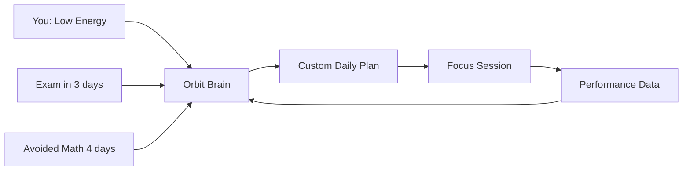

<div align="center">

# 🛰️ Orbit

### **Your brain doesn't work 9-to-5. Your study planner shouldn't either.**

**Stop fighting rigid calendars. Start studying with context-aware AI that adapts to your energy, deadlines, and real life.**

[](https://react.dev/)
[](https://www.typescriptlang.org/)
[](/)
[](/)

[Try Demo](#-quick-start) • [Features](#-what-makes-orbit-different) • [How It Works](./BRAIN.md) • [Install](#-installation)

---

### 🎯 **The Problem**

Traditional planners assume you're a robot:
- ❌ Same energy every day at 8 AM
- ❌ Perfect discipline, no bad days
- ❌ Static priorities that never change
- ❌ Midnight resets that break flow states

**Reality:** You study at 2 AM. Exams move. Energy fluctuates. Priorities shift hourly.

### ⚡ **The Solution**

Orbit generates your study plan **fresh every day** based on:
- ✅ Your actual energy level (Low/Normal/High)
- ✅ Upcoming exam deadlines (auto-prioritizes)
- ✅ Which subjects you've been avoiding
- ✅ Your focus session performance history

**No calendars. No rigid schedules. Just intelligent execution.**

</div>

---

## 🎨 What Makes Orbit Different

<table>
<tr>
<td width="50%">

### **🧠 AI That Learns You**
- **Adaptive Block Sizing**: Struggling with Physics? Get shorter, focused sessions automatically
- **Energy Matching**: Heavy tasks scheduled during your peak hours
- **Burnout Detection**: Proactive recovery suggestions before you crash

</td>
<td width="50%">

### **🎯 Smart Prioritization**
- **Decay Detection**: Auto-escalates subjects ignored 3+ days
- **Exam Proximity Engine**: Quadratic urgency scaling
- **Daily Context Calibration**: Energy + Deadlines → Optimal plan

</td>
</tr>
<tr>
<td>

### **⚡ Zero Friction Execution**
- **One-Click Focus Mode**: Full-screen, distraction-free
- **Session Reflections**: Rate quality, capture insights instantly
- **Configurable "Day Start"**: 4 AM default (for night owls)

</td>
<td>

### **🔒 100% Private & Offline**
- **Local-First**: Data never leaves your device
- **No Accounts**: No sign-ups, no tracking
- **Instant**: 0ms latency, works offline
- **Export Anytime**: You own your data

</td>
</tr>
</table>

---

## 🚀 Quick Start

```bash
# Clone & Run (60 seconds)
git clone https://github.com/santoshcheethirala/orbit.git
cd orbit
npm install && npm run dev

# Open http://localhost:5173
```

**First Session:**
1. Add subjects (Courses tab)
2. Calibrate your day (Dashboard → Set energy level)
3. Start a focus session (Pick a mission → Focus)

That's it. No tutorials. No setup hell.

---

## 🎯 Core Features

| Feature | What It Does | Why It Matters |
|---------|-------------|----------------|
| **Daily Context Engine** | Calibrate energy/mood before generating plan | Plans match reality, not fantasy |
| **Adaptive Displacement** | Auto-reschedules based on changing priorities | Exams don't sneak up on you |
| **Focus Session Protocol** | Distraction-free, full-screen study mode | Preserves flow state, tracks quality |
| **Spaced Repetition** | Ebbinghaus curve-based review scheduling | Actually retain what you learn |
| **AI Study Assistant** | Claude-powered concept clarification | Get unstuck instantly |
| **Analytics Dashboard** | Focus scores, streaks, subject heatmaps | See patterns, adjust strategy |

---

## 🛠️ Built With

```typescript
Frontend:    React 19 + TypeScript 5.8
Database:    Dexie.js (IndexedDB wrapper)
Styling:     Tailwind CSS
Build:       Vite 6.2
AI:          Claude (Anthropic API)
```

**Why Local-First?**
- ⚡ **Instant** - 0ms latency on every action
- 🔒 **Private** - Your study patterns stay on your device
- 💰 **Free** - No subscriptions, no cloud costs
- ✈️ **Offline** - Works on planes, trains, no WiFi needed

---

## 📊 How It Works (TL;DR)


```mermaid
graph LR
    A[You: Low Energy] --> B[Orbit Brain]
    C[Exam in 3 days] --> B
    D[Avoided Math 4 days] --> B
    B --> E[Custom Daily Plan]
    E --> F[Focus Session]
    F --> G[Performance Data]
    G --> B
```

**Deep Dive:** [Read BRAIN.md](./BRAIN.md) for algorithm details, heuristics, and technical architecture.

---

## 🎯 Perfect For

- 🌙 **Night owls** who study best after midnight
- 🔥 **Crammers** who need intelligent panic-mode planning
- 🧠 **STEM students** juggling heavy, interconnected subjects
- 📊 **Data nerds** who want analytics on their study patterns
- 🔒 **Privacy advocates** who hate cloud dependency

---

## 📸 Screenshots

> _Coming soon: Dashboard, Focus Mode, Analytics views_

---

## 🗺️ Roadmap

**Now (v3.0)**
- [x] Brain v3 with adaptive intelligence
- [x] AI study assistant integration
- [x] Quality rating system

**Next (Q2 2026)**
- [ ] Enhanced spaced repetition with flashcards
- [ ] Mobile native apps (iOS/Android)
- [ ] Pomodoro timer integration

**Future**
- [ ] Optional E2E encrypted cloud sync
- [ ] Study group collaboration features

---

## 🤝 Contributing

Found a bug? Want a feature? PRs welcome.

```bash
# Standard flow
1. Fork repo
2. Create feature branch
3. Make changes
4. Submit PR

# Areas we need help:
- Mobile responsiveness
- Accessibility (WCAG 2.1)
- i18n (internationalization)
- Bug fixes & stability
```

---

## 🔒 Privacy Guarantee

```
✅ No accounts or sign-ups
✅ No data leaves your device
✅ No telemetry or tracking
✅ No cookies or third-party scripts
✅ 100% open source & auditable
✅ Export your data anytime
```

Your study patterns are yours. Period.

---

## 📄 License

MIT © 2026 [Santosh Cheethirala](https://github.com/santoshcheethirala)

---

## 💬 Support & Community

- 🐛 **Bug Reports**: [GitHub Issues](https://github.com/santoshcheethirala/orbit/issues)
- 💡 **Feature Requests**: [GitHub Discussions](https://github.com/santoshcheethirala/orbit/discussions)
- 📧 **Contact**: [GitHub Profile](https://github.com/santoshcheethirala)

---

<div align="center">

### **Built for students who don't fit the mold.**

**Stop planning. Start executing.**

⭐ **Star this repo if Orbit helps you ace your exams**

[⬆ Back to Top](#-orbit)

</div>