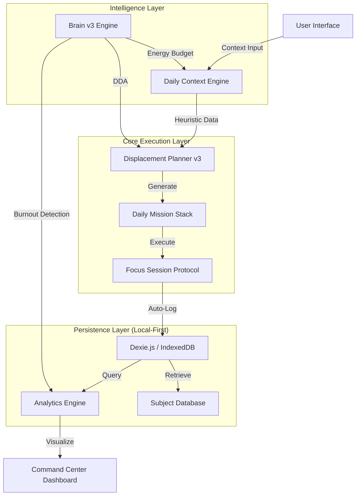

<div align="center">

# 🛰️ Orbit v3

### Mission Control for Students

*An energy-aware, local-first study execution system built for those who don't live by rigid calendars*

[](https://react.dev/)
[](https://www.typescriptlang.org/)
[](https://vitejs.dev/)
[](https://developer.mozilla.org/en-US/docs/Web/API/IndexedDB_API)
[](https://web.dev/progressive-web-apps/)
[](LICENSE)

[Features](#-features) • [Quick Start](#-quick-start) • [Documentation](#-core-systems) • [Roadmap](#-roadmap) • [Contributing](#-contributing)

</div>

---

## 📖 Table of Contents

- [Philosophy](#-the-philosophy-context-over-calendar)
- [Features](#-features)
- [Quick Start](#-quick-start)
- [System Architecture](#-system-architecture)
- [Core Systems](#-core-systems)
- [Tech Stack](#-tech-stack)
- [Project Structure](#-project-structure)
- [Usage Guide](#-usage-guide)
- [Advanced Configuration](#-advanced-configuration)
- [Performance](#-performance)
- [Troubleshooting](#-troubleshooting)
- [Roadmap](#-roadmap)
- [Contributing](#-contributing)
- [Privacy & Security](#-privacy--security)
- [License](#-license)

---

## 🧠 The Philosophy: Context over Calendar

Traditional planners fail because they assume every day is the same. **Orbit** is built on the reality of student life: inconsistent energy, late-night study streaks, and shifting academic priorities.

### 🌌 The Night-Owl Principle

Most planners reset at midnight—breaking your flow. Orbit features a **configurable day-start threshold** (default: 4:00 AM). Studying at 3:30 AM still counts as "today," preserving your focus streaks and mental momentum.

**Why This Matters:**
- No artificial boundaries disrupting deep work sessions
- Accurate tracking of actual productivity patterns
- Respect for different chronotypes and study rhythms
- Maintains streak psychology for late-night learners

---

## ✨ Features

### 🎯 Smart Planning
- **Context-Aware Scheduling**: Daily calibration based on energy, workload, and exam proximity
- **Adaptive Displacement Planning**: Automatically reschedules tasks based on changing priorities
- **Project Decay Detection**: Escalates subjects neglected for 3+ days
- **Exam Proximity Weighting**: Dynamic priority adjustment as deadlines approach
- **Workload Visualization**: 4-tier system (Light → Normal → Heavy → Extreme) with burnout warnings

### ⚡ Focus & Execution
- **Distraction-Free Focus Sessions**: Immersive, full-screen study environment
- **State Preservation**: Pause and resume without losing progress
- **Audio Feedback**: Subtle woodblock taps (300Hz) and glass chime success alerts
- **Session Reflections**: Capture immediate feedback with integrated note-taking
- **Quality Rating System**: Rate session effectiveness for continuous improvement

### 🧬 Intelligence Layer (Brain v3)
- **Dynamic Difficulty Adjustment (DDA)**: Auto-tunes block durations based on performance
- **Energy Budgeting**: Matches task intensity to your daily energy profile
- **Burnout Protection**: Monitors skip rates and mood patterns to suggest recovery
- **Spaced Repetition Integration**: Ebbinghaus curve-based review scheduling
- **AI Study Assistant**: Claude-powered study guidance and concept clarification

### 📊 Analytics & Insights
- **Focus Score Metrics**: Track concentration quality over time
- **Subject Heat Maps**: Visual representation of study distribution
- **Streak Tracking**: Daily, weekly, and monthly consistency metrics
- **Performance Trends**: Identify patterns in productivity and comprehension
- **Export Capabilities**: Generate reports for academic planning

### 🎨 User Experience
- **Space-Themed Glassmorphism UI**: Beautiful, modern interface with physics-based animations
- **Dark Mode Native**: Designed for extended study sessions
- **Mobile-First PWA**: Install on any device, works offline
- **Keyboard Shortcuts**: Power-user optimizations for rapid navigation
- **Customizable Themes**: Adjust colors and layouts to your preference

---

## 🚀 Quick Start

### Prerequisites

- **Node.js** 18.0 or higher ([Download](https://nodejs.org/))
- **npm** 9.0 or higher (comes with Node.js)

### Installation

```bash
# Clone the repository
git clone https://github.com/santoshcheethirala/orbit.git
cd orbit

# Install dependencies
npm install

# Start development server
npm run dev
```

The app will be available at `http://localhost:5173`

### First Launch Setup

1. **Add Your First Subject**
   - Navigate to "Courses" tab
   - Click "Add New Subject"
   - Configure exam dates and priorities

2. **Calibrate Your Day**
   - Go to Dashboard
   - Set your energy level (Low/Normal/High)
   - Choose day type (Normal/ISA/ESA)
   - Generate your study missions

3. **Start Your First Focus Session**
   - Select a mission from your daily queue
   - Click "Start Focus Session"
   - Work distraction-free until completion

---

## 🏗 System Architecture

Orbit utilizes a **Local-First Architecture**, ensuring 100% offline functionality and zero-latency interactions by keeping the entire database on the client side.

> 📘 **[Read the full Engineering Deep Dive (BRAIN.md)](./BRAIN.md)**


```mermaid
graph TD
    User[User Interface] -->|Context Input| Engine[Daily Context Engine]
    Engine -->|Heuristic Data| Planner[Displacement Planner v3]
    
    subgraph "Core Execution Layer"
        Planner -->|Generate| Missions[Daily Mission Stack]
        Missions -->|Execute| Focus[Focus Session Protocol]
    end

    subgraph "Persistence Layer (Local-First)"
        Focus -->|Auto-Log| Dexie[Dexie.js / IndexedDB]
        Dexie -->|Query| Stats[Analytics Engine]
        Dexie -->|Retrieve| Subjects[Subject Database]
    end

    Stats -->|Visualize| UI[Command Center Dashboard]
    
    subgraph "Intelligence Layer"
        Brain[Brain v3 Engine] -->|DDA| Planner
        Brain -->|Energy Budget| Engine
        Brain -->|Burnout Detection| Stats
    end
```

### Key Architectural Principles

1. **Zero-Latency Interactions**: All operations execute instantly without network delays
2. **Offline-First**: Full functionality without internet connection
3. **Data Sovereignty**: User owns 100% of their data locally
4. **Progressive Enhancement**: Advanced features layer on top of core functionality
5. **Resilient State Management**: Automatic recovery from crashes or interruptions

---

## 🎯 Core Systems

### 1. Daily Context Engine

Every day begins with a **Calibration Step**. Instead of a static schedule, you feed the engine your current reality:

**Input Parameters:**
- **Energy Level**: Low / Normal / High
  - *Low*: Reduced cognitive load, lighter tasks prioritized
  - *Normal*: Standard workload distribution
  - *High*: Intensive tasks front-loaded for maximum efficiency

- **Day Type**: 
  - *Normal*: Regular study day
  - *ISA (Internal Assessment)*: Exam preparation mode
  - *ESA (External Assessment)*: High-stakes exam day protocols

- **Conditions**: Holiday, sick, unexpected workload, or custom flags

**Output:**
- Dynamically generated mission queue
- Adjusted time allocations per subject
- Intelligent task sequencing based on cognitive load

### 2. Adaptive Displacement Planner

Orbit's proprietary algorithm converts your context into optimized study blocks using multi-factor prioritization:

**Priority Factors:**
- **Project Decay Detection**: Auto-escalates subjects neglected for 3+ days
- **Exam Proximity**: Quadratic increase in priority as deadlines approach
- **Difficulty Weighting**: Harder subjects get prime cognitive hours
- **Energy Matching**: Heavy tasks scheduled during peak energy windows
- **Completion Velocity**: Recent progress influences future allocations

**Workload Analysis:**
- 🟢 **Light** (1-3 hours): Normal cognitive load
- 🟡 **Normal** (3-5 hours): Standard study day
- 🟠 **Heavy** (5-7 hours): High-intensity preparation
- 🔴 **Extreme** (7+ hours): Burnout warning with recovery suggestions

### 3. Focus Session Protocol

A tactile, distraction-free environment engineered for deep work:

**Features:**
- **Full-Screen Immersion**: Eliminates external distractions
- **State Preservation**: Pause/resume with zero data loss
- **Timer Flexibility**: Pomodoro-style breaks or continuous flow
- **Progress Tracking**: Real-time visualization of session completion
- **Quality Reflection**: Immediate post-session effectiveness rating

**Audio Design:**
- Subtle woodblock taps (300Hz) for action confirmations
- Glass chime alerts for session milestones
- Optional ambient noise integration (coming soon)

**Session Data Captured:**
- Duration and timestamps
- Pause/resume patterns
- Quality rating (1-5 stars)
- Reflection notes
- Completion percentage

### 4. Enhanced Intelligence Layer (Brain v3)

The newest update introduces human-centric AI optimizations:

**Dynamic Difficulty Adjustment (DDA):**
- Analyzes session completion rates
- Detects if subjects are too easy (consistent 100% completion)
- Identifies struggling subjects (frequent early exits)
- Auto-tunes future block durations accordingly

**Energy Budgeting:**
- Learns your peak performance windows
- Prevents burnout by matching intensity to capacity
- Suggests optimal break timing based on fatigue patterns

**Burnout Protection System:**
- Silent monitoring of skip rates
- Mood pattern analysis across sessions
- Proactive recovery day suggestions
- Maintains sustainable study velocity

**Spaced Repetition Intelligence:**
- Ebbinghaus curve integration
- Automated review scheduling
- Optimal retention interval calculation
- Progressive difficulty ramping

---

## 🛠 Tech Stack

| Domain | Technology | Version | Reason for Choice |
|--------|-----------|---------|-------------------|
| **Frontend** | React | 19.x | Concurrent rendering for ultra-responsive UI updates |
| **Type Safety** | TypeScript | 5.8+ | Strict typing for complex mission-generation logic |
| **Database** | Dexie.js | 4.x | Robust local-first persistence with IndexedDB wrapper |
| **Styling** | Tailwind CSS | 3.x | Utility-first for rapid glassmorphism UI development |
| **Build Tool** | Vite | 6.2+ | Lightning-fast HMR and optimized production builds |
| **Icons** | Lucide React | Latest | Lightweight, tree-shakeable icon library |
| **Fonts** | Space Grotesk, Inter | - | Modern, readable typefaces for extended reading |
| **State Management** | React Context | Built-in | Lightweight solution for app-wide settings |

### Why Local-First?

Traditional cloud-based planners suffer from:
- ❌ Network latency on every action
- ❌ Privacy concerns with sensitive study data
- ❌ Vendor lock-in and data portability issues
- ❌ Offline functionality limitations
- ❌ Subscription costs for basic features

Orbit's local-first architecture provides:
- ✅ Instant response times (0ms latency)
- ✅ Complete privacy (data never leaves device)
- ✅ Full offline functionality
- ✅ No subscriptions or accounts required
- ✅ Export data anytime, anywhere

---

## 📂 Project Structure

```bash
orbit/
├── public/                  # Static Assets
│   ├── manifest.json       # PWA configuration
│   ├── icon-192.png        # App icons
│   └── sw.js              # Service worker (optional)
│
├── src/                    # Source Code
│   ├── components/        # React Components
│   │   ├── ui/           # Reusable UI primitives
│   │   ├── SpaceBackground.tsx  # Canvas-based space animation
│   │   ├── Toast.tsx     # Notification system
│   │   └── QualityRatingModal.tsx  # Session rating dialog
│   │
│   ├── views/            # Main Application Views
│   │   ├── Dashboard.tsx        # Mission control center
│   │   ├── Courses.tsx          # Subject management hub
│   │   ├── Stats.tsx            # Analytics dashboard
│   │   ├── FocusSession.tsx     # Immersive study mode
│   │   ├── SpacedRepetition.tsx # Review scheduler
│   │   ├── SettingsView.tsx     # User preferences
│   │   └── AIStudyAssistant.tsx # AI helper interface
│   │
│   ├── lib/              # Core Logic & Utilities
│   │   ├── brain.ts              # Mission generation algorithm
│   │   ├── brain-enhanced-integration.ts  # Brain v3 extensions
│   │   ├── db.ts                # Dexie schema & migrations
│   │   └── tracking.ts          # Analytics & logging
│   │
│   ├── contexts/         # React Context Providers
│   │   └── SettingsContext.tsx  # Global app settings
│   │
│   ├── index.tsx         # Application entry point
│   ├── index.css         # Global styles & animations
│   └── index.html        # HTML template
│
├── README.md            # This file
├── package.json         # Dependencies & scripts
├── tsconfig.json        # TypeScript configuration
└── vite.config.ts       # Vite build configuration
```

---

## 📚 Usage Guide

### Adding Subjects

1. Navigate to **Courses** tab
2. Click **"Add New Subject"** button
3. Fill in details:
   - Subject name
   - Exam date (optional)
   - Priority level (Low/Medium/High)
   - Difficulty rating (1-10)
4. Click **Save**

### Generating Daily Missions

1. Go to **Dashboard**
2. Click **"Calibrate Day"** button
3. Set parameters:
   - Energy level
   - Day type
   - Any special conditions
4. Click **"Generate Missions"**
5. Review your customized study queue

### Executing Focus Sessions

1. Select a mission from your daily queue
2. Click **"Start Focus Session"**
3. Work in full-screen mode
4. Use **Pause** if you need a break
5. Click **Complete** when finished
6. Rate session quality (1-5 stars)
7. Add reflection notes (optional)

### Tracking Progress

1. Visit **Stats** tab
2. View metrics:
   - Total study time
   - Focus score trends
   - Subject distribution
   - Streak counter
3. Adjust study patterns based on insights

### Using AI Study Assistant

1. Open **AI Assistant** panel
2. Ask questions about:
   - Concept clarification
   - Study strategies
   - Topic summaries
   - Exam preparation tips
3. Get instant, context-aware responses

---

## ⚙️ Advanced Configuration

### Customizing Day Start Time

```typescript
// In SettingsView.tsx or browser console
localStorage.setItem('dayStartHour', '5'); // Sets day start to 5:00 AM
```

### Adjusting Focus Session Defaults

```typescript
// Default session duration (minutes)
const DEFAULT_SESSION_LENGTH = 50;

// Break duration (minutes)
const DEFAULT_BREAK_LENGTH = 10;
```

### Configuring Audio Feedback

Enable/disable audio cues in **Settings** > **Audio Preferences**

### Exporting Your Data

```typescript
// Open browser console on Stats page
const exportData = async () => {
  const db = await Dexie.open('orbitdb');
  const data = await db.export();
  const blob = new Blob([data], { type: 'application/json' });
  const url = URL.createObjectURL(blob);
  const a = document.createElement('a');
  a.href = url;
  a.download = `orbit-backup-${Date.now()}.json`;
  a.click();
};
exportData();
```

---

## ⚡ Performance

### Benchmarks (M1 MacBook Air)

| Metric | Performance |
|--------|------------|
| Initial Load Time | < 1.2s |
| Mission Generation | < 50ms |
| Database Query (1000 sessions) | < 10ms |
| Focus Session Start | < 100ms |
| UI Interaction Response | < 16ms (60 FPS) |

### Optimization Techniques

- **Code Splitting**: Lazy-loaded routes for faster initial load
- **Memoization**: React.memo on expensive components
- **IndexedDB Indexing**: Optimized queries with compound indexes
- **Virtual Scrolling**: Efficient rendering of large session lists
- **Web Workers**: Offloading heavy computations (coming soon)

---

## 🐛 Troubleshooting

### Common Issues

**Problem: Missions not generating**
- **Solution**: Ensure at least one subject is added with a priority level
- Check browser console for errors
- Try clearing IndexedDB: `localStorage.clear()` then refresh

**Problem: Focus sessions not saving**
- **Solution**: Check browser storage quota
- Ensure IndexedDB is enabled (not in private browsing)
- Verify Dexie.js is properly initialized

**Problem: UI freezing during navigation**
- **Solution**: Clear browser cache
- Check for memory leaks (DevTools > Performance)
- Update to latest version

**Problem: Audio not playing**
- **Solution**: Check browser autoplay permissions
- Ensure audio is enabled in Settings
- Test with different browsers

### Debugging Tips

1. **Enable verbose logging:**
   ```typescript
   localStorage.setItem('DEBUG', 'true');
   ```

2. **Inspect database:**
   - Open DevTools > Application > IndexedDB
   - Browse `orbitdb` database tables

3. **Check storage usage:**
   ```javascript
   navigator.storage.estimate().then(console.log);
   ```

### Getting Help

- 🐛 Issues: [GitHub Issues](https://github.com/santoshcheethirala/orbit/issues)
- 💬 Discussions: [GitHub Discussions](https://github.com/santoshcheethirala/orbit/discussions)

---

## 🗺 Roadmap

### Phase 1: Stability & Polish (Q1 2026) ✅
- [x] Brain v3 intelligence layer
- [x] AI Study Assistant integration
- [x] Quality rating system
- [ ] Performance optimization audit
- [ ] Comprehensive unit test coverage
- [ ] Accessibility improvements (WCAG 2.1 AA)

### Phase 2: Spaced Repetition (Q2 2026) 🚧
- [ ] Ebbinghaus curve implementation
- [ ] Flashcard system integration
- [ ] Automatic review scheduling
- [ ] Knowledge retention metrics
- [ ] Forgetting curve visualization

### Phase 3: Collaboration & Sync (Q3 2026) 📋
- [ ] End-to-end encrypted cloud sync (optional)
- [ ] Multi-device synchronization
- [ ] Study group features
- [ ] Shared subject libraries
- [ ] Export to Google Calendar

### Phase 4: Advanced Analytics (Q4 2026) 💡
- [ ] Machine learning-based predictions
- [ ] Productivity heatmaps
- [ ] Customizable dashboards
- [ ] Academic performance correlations
- [ ] Goal tracking & milestones

### Future Considerations
- Mobile native apps (iOS/Android)
- Browser extension for quick capture
- Pomodoro timer integration
- Integration with note-taking apps
- Voice command support

---

## 🤝 Contributing

We welcome contributions from the community! Whether you're fixing bugs, adding features, or improving documentation, your help is appreciated.

### Getting Started

1. **Fork the repository**
   ```bash
   git clone https://github.com/YOUR_USERNAME/orbit.git
   ```

2. **Create a feature branch**
   ```bash
   git checkout -b feature/amazing-feature
   ```

3. **Make your changes**
   - Write clean, documented code
   - Follow existing code style
   - Add tests for new features

4. **Commit your changes**
   ```bash
   git commit -m 'Add amazing feature'
   ```

5. **Push to your fork**
   ```bash
   git push origin feature/amazing-feature
   ```

6. **Open a Pull Request**
   - Describe your changes clearly
   - Link related issues
   - Await review and feedback

### Code Style Guidelines

- Use TypeScript strict mode
- Follow Airbnb style guide
- Write meaningful commit messages
- Document complex logic
- Keep components under 300 lines

### Areas We Need Help

- 🐛 Bug fixes and stability improvements
- 📱 Mobile responsiveness enhancements
- ♿ Accessibility features
- 🌍 Internationalization (i18n)
- 📝 Documentation improvements
- 🎨 UI/UX design refinements

---

## 🔒 Privacy & Security

### Data Sovereignty

Orbit is **Local-First by Design**. Your data never leaves your device.

**What This Means:**
- ✅ No user accounts or authentication required
- ✅ No data transmission to external servers
- ✅ No telemetry or analytics tracking
- ✅ No cookies or third-party scripts
- ✅ Complete data portability (export anytime)

### Security Features

- **IndexedDB Encryption**: Browser-level storage security
- **No External Dependencies**: All code runs locally
- **Open Source**: Fully auditable codebase
- **HTTPS-Only**: Served over secure connections (when deployed)

### Data Export

Your data belongs to you. Export functionality:
```typescript
// Full database export (JSON format)
await db.export();
```

---

## 📄 License

This project is licensed under the **MIT License** - see the [LICENSE](LICENSE) file for details.

```
MIT License

Copyright (c) 2026 Santosh Cheethirala

Permission is hereby granted, free of charge, to any person obtaining a copy
of this software and associated documentation files (the "Software"), to deal
in the Software without restriction, including without limitation the rights
to use, copy, modify, merge, publish, distribute, sublicense, and/or sell
copies of the Software...
```

---

## 🙏 Acknowledgments

- **Design Inspiration**: Modern space exploration UIs
- **Algorithm Research**: Cognitive science and spaced repetition studies
- **Community**: All contributors and beta testers
- **Libraries**: React, Dexie.js, Tailwind CSS, and the open-source community

---

## 📞 Contact & Support

**Built with ❤️ for Night Owls by [Santosh Cheethirala](https://github.com/santoshcheethirala)**

*Engineering Intelligently Adaptive Interfaces*

- 🌐 Website: [orbit-study.app](https://orbit-study.app) (coming soon)
- 🐛 GitHub: [github.com/santoshcheethirala/orbit](https://github.com/santoshcheethirala/orbit)
- 💼 LinkedIn: [Santosh Cheethirala](https://linkedin.com/in/santoshcheethirala)

---

<div align="center">

**If Orbit helps you ace your exams, consider giving it a ⭐ on GitHub!**

[⬆ Back to Top](#-orbit-v3)

</div>  